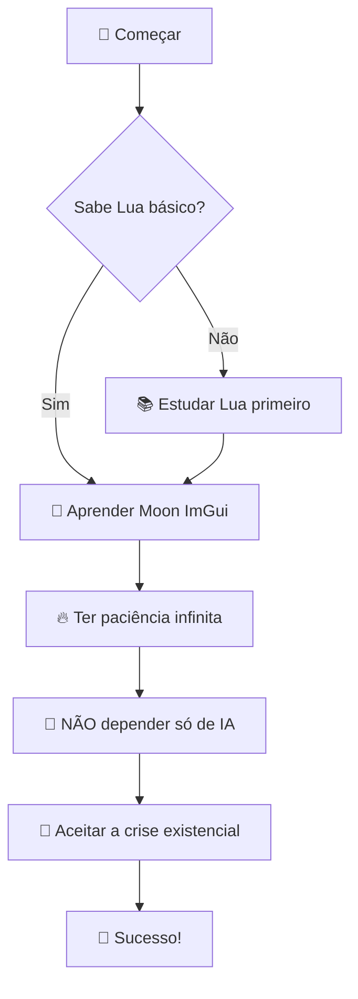

<div align="center">


  
# 🐐 Projeto Bode
  


### *Mod Menu Brasileiro para SA-MP em Lua* 🇧🇷


</div>

---

## 📋 **Sobre o Projeto**

> **Projeto Bode** é um mod menu brasileiro desenvolvido em Lua para **SA-MP (San Andreas Multiplayer)**. 
> O objetivo é expandir o conhecimento da comunidade brasileira sobre desenvolvimento de cheats usando a linguagem Lua.

### 🎯 **Características**
- ✅ Interface moderna com **ImGui**
- ✅ Compatível com **Moonloader** 
- ✅ Recursos avançados de rede (**RakLua**)
- ✅ Integração com **Discord WebHook**
- ✅ Ícones **FontAwesome v5**

---

## 👨‍💻 **Sobre o Desenvolvedor**

<div align="center">

### 🐐 **Codinome: Bode**
*Dev (ou quase Dev) especializado em Lua*

</div>

Focado em compartilhar conhecimento sobre desenvolvimento de mods para SA-MP, especialmente na linguagem Lua. O projeto visa democratizar o acesso ao conhecimento técnico da comunidade brasileira.

> ⚠️ **Nota Importante**: Este projeto é exclusivamente para **SA-MP PC** com **Moonloader**, não **Monetloader**.

---

## 🛠️ **Stack Tecnológica**

<div align="center">

| Tecnologia | Descrição | Status |
|------------|-----------|--------|
| 🌙 **ImGui** | Interface gráfica moderna | ✅ Ativo |
| 🌐 **Samp Events** | Eventos do SA-MP | ✅ Ativo |
| 📡 **RakLua** | Manipulação de rede | ✅ Ativo |
| ⚡ **FFI** | Interface para C | ✅ Ativo |
| 🎨 **FontAwesome v5** | Ícones modernos | ✅ Ativo |
| 🔗 **OpenUrl** | Abertura de URLs | ✅ Ativo |
| 🎣 **Discord WebHook** | Integração Discord | ✅ Ativo |

</div>

---

## 📸 **Preview Atual**

<div align="center">


*Menu atual em desenvolvimento*

</div>

---

## 🔗 **Recursos e Referências**

### 📚 **Bibliotecas Utilizadas**

<details>
<summary>🌐 <strong>Samp Events</strong></summary>

- **Repositório**: [SAMP.Lua](https://github.com/THE-FYP/SAMP.Lua/tree/master)
- **Função**: Gerenciamento de eventos do SA-MP
- **Status**: ✅ Integrado

</details>

<details>
<summary>📡 <strong>RakLua (Raknet)</strong></summary>

- **Repositório**: [RakLua](https://github.com/Northn/RakLua/tree/master)
- **Função**: Manipulação de pacotes de rede
- **Status**: ✅ Integrado

</details>

<details>
<summary>🎨 <strong>ImGui & Addons</strong></summary>

- **ImGui Original (C++)**: [ocornut/imgui](https://github.com/ocornut/imgui)
- **Moon ImGui (Lua)**: [BlastHack Thread](https://www.blast.hk/threads/19292/page-90#post-318303)
- **Tutoriais**:
  - 📹 [ImGui Addons Pt.1](https://www.youtube.com/watch?v=rznHB5ROJoE)
  - 📹 [ImGui Addons Pt.2](https://www.youtube.com/watch?v=R_FUKu8zPRw)

</details>

<details>
<summary>🎯 <strong>FontAwesome v5</strong></summary>

- **Thread**: [BlastHack FontAwesome](https://www.blast.hk/threads/156617/)
- **Tutorial**: 📹 [Implementação FontAwesome](https://www.youtube.com/watch?v=B4B5CBQLJZ0)
- **Status**: ✅ Implementado

</details>

---

## ⚡ **Requisitos para Desenvolvimento**

<div align="center">



</div>

### ✅ **Checklist do Dev**

- [ ] 📖 Dominar o básico de **Lua**
- [ ] 🌙 Entender **Moon ImGui** 
- [ ] ⏰ Ter **paciência** (muito importante!)
- [ ] 🧠 **NÃO** depender 100% de IAs
- [ ] 😵‍💫 Estar preparado para a **crise existencial**
- [ ] 🔥 Persistência level **over 9000**

---

## 🎯 **Roadmap**

```
🚀 Fase 1: Base do Menu        ✅ Concluído
🛠️  Fase 2: Funcionalidades     🔄 Em andamento  
🎨 Fase 3: UI/UX Melhorias     ⏳ Planejado
📱 Fase 4: Otimizações         ⏳ Futuro
🌟 Fase 5: Release Final       ⏳ TBD
```

---

<div align="center">

## 🤝 **Contribuições**

Contribuições são bem-vindas! Sinta-se livre para:

- 🐛 Reportar bugs
- 💡 Sugerir melhorias  
- 🔧 Enviar pull requests
- 📚 Melhorar documentação

---

### 💬 **Contato**

**Codinome Bode** | *Lua Developer*

📧 *Entre em contato via Issues do GitHub*

---


*"Todo dev precisa de uma crise existencial para evoluir"* 

</div>
